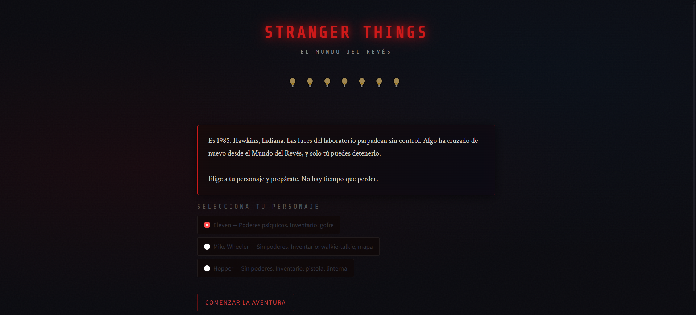

# El mundo del revés


---



---

**Aventura de texto interactiva con estética de Stranger Things, construida con Python y Streamlit. Desarrollada como demostración para alumnos de secundaria de cómo los conceptos de Programación Orientada a Objetos (POO) y herencia pueden materializarse en una interfaz web real.**

---

## 🔗 Prueba la aplicación en tu navegador

- 🚀 [Demo en vivo — Streamlit Community Cloud](https://mundo-del-reves.streamlit.app/)

---

## 📖 Descripción detallada

**El mundo del revés** es una aventura de texto interactiva diseñada con fines educativos. Su objetivo es acercar a los alumnos de secundaria a los conceptos fundamentales de la Programación Orientada a Objetos (POO) de una manera lúdica y visualmente atractiva, utilizando la estética de la serie Stranger Things.

La aplicación permite a los usuarios tomar decisiones que afectan el transcurso de la historia, interactuar con personajes y enfrentarse a monstruos, todo ello gestionado mediante una estructura de clases, herencia y polimorfismo.** 

---

## 📌 Características principales

- **Implementación de POO:** Uso de clases padre (`Personaje`) y clases hijas (`Heroe`, `Monstruo`) con herencia (`super()`).
- **Polimorfismo:** Método `hablar()` sobrescrito en cada clase hija para comportamientos específicos.
- **Gestión de estado:** Uso de `st.session_state` para mantener el progreso del jugador entre pantallas.
- **Enrutador de pantallas:** Sistema de navegación que dirige al jugador según sus decisiones.
- **Personalización educativa:** Código diseñado para ser fácilmente modificable por alumnos (añadir personajes, cambiar atributos, añadir decisiones).

---

## 🏗️ Arquitectura

```
stranger_things_app/
├── app.py              # Aplicación principal (lógica + interfaz)
├── requirements.txt    # Librerías necesarias
└── README.md           # Este archivo
```

---


## 🤖 Desarrollo asistido por IA (Vibe Coding)

Este ecosistema ha sido desarrollado íntegramente mediante **AI-Driven Development**, orquestando modelos avanzados de lenguaje (LLMs) para la arquitectura, lógica y diseño. Las fases clave han incluido conceptualización arquitectónica y un proceso iterativo de depuración de código guiado exclusivamente por IA.

---

## 🛠️ Stack tecnológico

| Tecnología | Versión | Rol |
|---|---|---|
| [Python](https://www.python.org/) | 3.9+ | Lenguaje base |
| [Streamlit](https://streamlit.io/) | 1.35.0 | Framework de interfaz web |

---

## ⚡ Instalación y puesta en marcha

### 1. Clonar el repositorio

```bash
git clone https://github.com/ariaslombardero/stranger-things-app.git
cd stranger-things-app
```

### 2. Crear y activar un entorno virtual (recomendado)

```bash
python -m venv .venv

# Windows
.venv\Scripts\activate

# macOS / Linux
source .venv/bin/activate
```

### 3. Instalar dependencias

```bash
pip install -r requirements.txt
```

### 4. Ejecutar la aplicación

```bash
streamlit run app.py
```

La aplicación se abrirá automáticamente en `http://localhost:8501`.

---

## 📄 Uso y personalización educativa

Este proyecto ha sido concebido para uso educativo. Se sugieren los siguientes puntos de modificación para mostrar a los alumnos cómo pequeños cambios tienen efecto inmediato:

- **Cambiar los personajes disponibles**: busca el diccionario `personajes` dentro de `pantalla_inicio()` y añade o modifica entradas.
- **Cambiar el daño del Demogorgon**: modifica `nivel_demogorgon` al crear el objeto `Monstruo` en `init_state()`.
- **Añadir un tercer personaje**: crea una clase `Aliado` que herede de `Personaje` y sobrescriba `hablar()`.
- **Añadir una tercera decisión**: crea una función `pantalla_decision_3()` siguiendo el mismo patrón que las existentes y añádela al diccionario `pantallas`.

---

## 🚀 Desplegar en Streamlit Community Cloud

1. Sube el repositorio a GitHub (debe ser público).
2. Entra en [share.streamlit.io](https://share.streamlit.io) con tu cuenta de GitHub.
3. Haz clic en **New app**.
4. Selecciona el repositorio, la rama (`main`) y el archivo principal (`app.py`).
5. Haz clic en **Deploy**.

---

## 📄 Uso

Este proyecto ha sido concebido para uso demostrativo, educativo y como prueba de concepto (PoC) del potencial transformador que tienen las tecnologías generativas en la creación rápida de software.

---

## 🤝 Contribuciones

Las contribuciones son bienvenidas. Si deseas ampliar el contenido, añadir funcionalidades, o sugerir mejoras arquitectónicas, puedes abrir un *Issue* o enviar un *Pull Request* al repositorio.

---

## 📜 Licencia

Este proyecto está bajo la Licencia **MIT**. Consulta el archivo [LICENSE](./LICENSE) incluido en el repositorio para más detalles.

---

## 👨‍💻 Autor

**Jose Antonio Arias Lombardero**
*Experto en Inteligencia Artificial aplicada al sector público, innovación, contratación y fondos europeos.*

Esta aplicación forma parte de un portfolio de soluciones tecnológicas conceptualizadas, desarrolladas y desplegadas en entornos cloud para su aplicación en el sector público y en otros sectores. Mi objetivo es demostrar cómo el uso estratégico de modelos avanzados de IA (Vibe Coding) puede escalar radicalmente la digitalización, la operatividad y la alfabetización tecnológica de la Administración y del resto del sector público.
